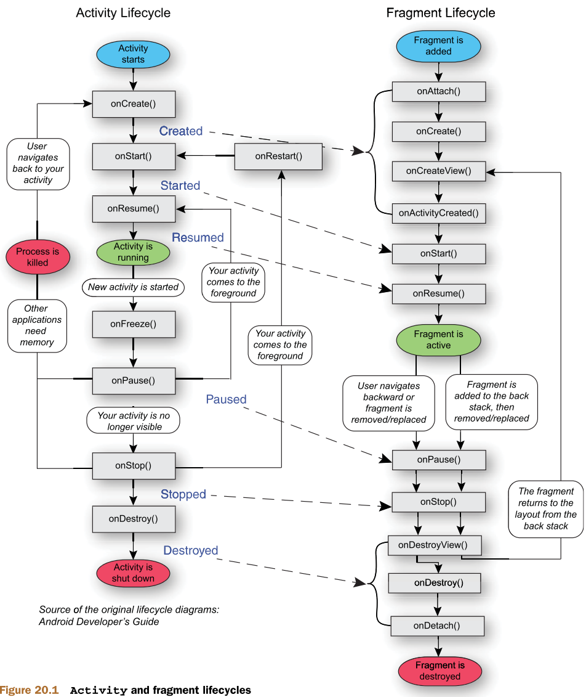
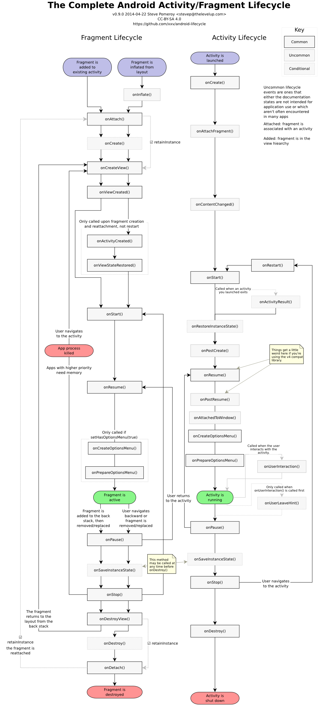

# Android Cheat Sheet 
### Author: `bluelul.com`
<br>

# Install
## Ubuntu
1. Download Android Studio at [Android Homepage](https://developer.android.com/studio).
2. Extract to any folder you want, i.e. *{installation home}*
3. Open terminal at *{installation home}*
```bash
./bin/studio.sh
```
4. Follow instruction to install Android Studio (`custom option` recommended)

## Note
- If your computer supports GPU (especially NVIDIA), install GPU driver for optimizing AVD (Android Virtual Device) perfomance.
```
sudo ubuntu-drivers autoinstall
```
- If you can not start Android Emulator, with error `/dev/kvm device permission denied`, then run these commands:
```
sudo apt install qemu-kvm
sudo adduser $USER kvm
sudo chown $USER /dev/kvm
```

<br>

# Customize
## Theme
1. Open **File &rarr; Settings &rarr; Plugins** in Android Studio
2. Install theme you want. Recommend: `One Dark Theme`, `Hiberbee Theme`, `Material Theme`

<br>

# Tweak
## Keep Android Emulator always on top
On active widow emulator, press `ALT + SPACE`, select `always on top`
## Logcat monitor tool (Ubuntu)
- Colorize logcat:
```bash
sudo snap install logcat-colorize
adb shell logcat | logcat-colorize
```

<br>

# Code snippet / Live Template
## Install template
1. Copy all content of bluelulAndroid.xml to clipboard
2. Open **File &rarr; Settings** (`Ctrl + Alt + S`) in Android Studio, then **Editor &rarr; Live Templates**
3. Press `+` button on the right (or press `Alt + Insert`) and choose `Template Group`
4. Input `AndroidBluelul` or any name you want
5. Press `Ctrl + V` to add all copied templates to this group

## Log
- `logt` : assign TAG
- `logi` : log info
- `loge` : log error
- `logd` : log debug

## Bind layout
- `find` : bind XML component in layout to Java object
- `findquick` : bind XML component in layout to Java object without declaring

## Button
- `btnclick` : set OnClick Listener to button object (non-lambda style)
- `btnclickquick` : set OnClick Listener to button object (lambda style + non pre-declared)
- *`button.setOnClickListener(v -> {})`* : set OnClick Listener to button object (lambda style)

## TextView
- *`textView.setText(valueStr)`* : change content of TextView object

## EditText
- *`editText.setText(valueStr)`* : change content of TextView object
- *`editText.length()`* : get text length
- *`editText.setError("show error")`* : trigger error in EditText object
- `textchangewatch` : handle text change event

## TextInputLayout
- *`editText.setText(valueStr)`* : change content of TextView object
- *`editText.length()`* : get text length
- *`editText.setError("show error")`* && *`editText.setErrorEnabled(true)`* : show error in TextInputLayout object
- *`editText.setErrorEnabled(false)`* : hide error in TextInputLayout object
- `textchangewatch` : handle text change event

## Radio
- *`radioGroup.getCheckedRadioButtonId()`* : return Resource ID of checked radio button (e.g. R.id.radioButton), return -1 if no button checked

## Activity
- `swact` : switch to another activity
- `loadintent` : load input argument of activity after being created
- *`overridePendingTransition(R.anim.trans_left_in, R.anim.trans_left_out)`* : swipe left to new activity, run after triggering activity
- *`overridePendingTransition(R.anim.trans_right_in, R.anim.trans_right_out)`* : swipe right to previous activity, run after triggering activity

## Fragment
Note: layout-related code should be placed on `onViewCreated` method, and use `view.findViewById` instead of `this.findViewById`
- `fragreplace` : Replace fragment to frame layout
- `fragadd` : Add (overlay) fragment to frame layout

## Intent
- `call` : dial a phone number
- `sms` : compose a SMS message to a phone number
- `web` : browse a website
- `mail` : compose an email

## Clipboard
- `clipman` : declare ClipboardManager object
- `clipcopytext` : copy plain text to clipboard
- `clippastetext` : paste plain text from clipboard
- `clipcopyintent` : copy intent to clipboard
- `clippasteintent` : paste intent from clipboard and run intent
- `clipcopyrawuri` : copy raw uri to clipboard
- `clippasteuri` : paste uri from clipboard

## URI
- `res2uri` : parse URI from Resource ID

## Toast
- `toast` : make new toast
- *`toast.setGravity(Gravity.CENTER | Gravity.TOP, 0, 0)`* : change toast position

## Snackbar
- `snack` : make snackbar with button
- `snacktext` : make new snackbar (for notification)

<br>

# Layout tweak
- Fill white color to icon of layout component: `app:tint="@color/white"`
- Round button: `app:cornerRadius="100dp"`
- Only-contain-icon button: `app:iconGravity="textStart"` `app:iconPadding="0dp"`
- List-item can't be click after contain buttons: add `android:focusable="false"` to all buttons and clickable components
- Hide spell check but keep autocomplete for EditText: `android:inputType="_current_input_type_|textPersonName"` 

<br>

# Quickcode template
Templates are stored in [/quickcode folder](quickcode)
- `double back to exit` : press back button 2 times to exit app
- `floating action button expandable` : press the `(+)` fab to expand more fabs
- `listview simple` : make simple listview (only text, single choice, multiple choice)
- `listview card` : make card listview (1 item contains: avatar image, main name text, sub name text)
- `listview order` : make food order listview (1 food item contains: image, name, description, price, count number, add button, remove button (long press to empty all))
- `landview linearlayout adapt` : re-arrange layout when phone orientation change between landscape (horizonal) and portrait (vertical) by changing orientation of linearlayouts

<br>

# Protection Level

## Normal
- Default protectionLevel of permissions with low risk to other apps, system or user
- Automatic granted to requested app, without prompting the user
- User allows permission before installing app

## Dangerous
- Higher than `Normal`
- Permissions with high risk to private user data accessing or device controlling, e.g. get location, write contact, answer phone call, etc.
- Only granted after asking the user

## Privileged
- Higher than `Dangerous`
- Only granted to apps installed under the folder `/system/priv-app`
- Apps installed in `/system/priv-app` will have `Privileged` level
- Read more about [system app behaviour](#systemApp)
### How to elevate
- Method 1: hot install
    - Get the right to write to read-only /system folder: [the usual way](#writableEmu)
    - Install app.apk to Android OS: 
    ```bash
    adb install app.apk
    ```
    - Upload app.apk to device/emulator: 
    ```bash
    adb push app.apk /system/priv-app
    ```
    - Reboot device/emulator: 
    ```bash
    adb reboot
    ```
    - `Note`: to uninstall, first remove /system/priv-app/app.apk, then reboot and uninstall as normal app
- Method 2: build with OS
    - Place app in /system/priv-app
    - Build app along with your custom Android OS 
    - Flash this OS to your device

## Signature
- Higher than `Privileged`
- Only granted to app signed with OEM system certificate
- Elevate an app with Signature right by signing this app with `platform signature`, issued by device manufacturer (OEM)
- Read more about [system app behaviour](#systemApp)
### How to elevate
- Method 1: sign by public & private key (the easiest way)
    - Get platform.x509.pem (public key) and platform.pk8 (private key)
        - For Android Emulator: download from [aosp-mirror](https://github.com/aosp-mirror/platform_build/tree/master/target/product/security), or get files directly from [/sign folder](sign) in this repo
        - For custom device: get files from `build/target/product/security/` in android source code folder
    - Install `apksigner 0.9` with `apksigner_0.9-1_all.deb` file in [/sign folder](sign) in this repo
    ```bash
    sudo apt install -y fastjar jarwrapper
	sudo dpkg -i apksigner_0.9-1_all.deb
    ```
    - Sign your app with given public & private key:
    ```bash
    apksigner sign --key platform.pk8 --cert platform.x509.pem --out `pwd`/sign.apk unsign.apk
    ```
- Method 2: sign by keystore
    - Get platform.x509.pem (public key) and platform.pk8 (private key), as in Method 1
    - Get keytool-importeypair from [github repo](https://github.com/getfatday/keytool-importkeypair/blob/master/keytool-importkeypair), or from [/sign folder](sign) in this repo
    - Generate your keystore file 
    ```bash
    sudo chmod 777 keytool-importkeypair.sh
    ./keytool-importkeypair.sh -k key.keystore -p android -pk8 platform.pk8 -cert platform.x509.pem -alias platform
    ```
    - Grant an App the System Uid (Optional): in the <manifest> tag in AndroidManifest.xml file, add the attribute `android:sharedUserId="android.uid.system"`
    - Use keystore file to sign your app in one of below ways: 
        - On Android Studio, clicking on 'Build--> Generate Signed Bundle / APK' (alias: platform, password: android)
        - Install `apksigner` (as in Method 1), then run this command:
        ```bash
        apksigner sign --ks key.keystore --ks-pass pass:android --out `pwd`/sign.apk unsign.apk
        ```
        - On Android Studio, using signingConfig in your app's .gradle
        ```bash
        signingConfigs {
            config {
                storeFile file("key.keystore")
                storePassword 'android'
                keyAlias 'platform'
                keyPassword 'android'
            }
        }

        buildTypes {
            release {
                signingConfig signingConfigs.config
            }
        }
        ```
- Method 3: build with OS
    - Place app in /system/priv-app to prevent being uninstalled by user (optional, but prefer)
    - Add LOCAL_CERTIFICATE := platform to the app's Android.mk
    - Build app along with your custom Android OS 
    - Flash this OS to your device

## SignatureOrSystem
- Old synonym for `Signature|Privileged`, deprecated in API level 23
- Accessed by signed app or privileged app
- The easiest way to achieve is by elevating privileged right with Method 1 (hot install to /system/priv-app)

## System
- Old synonym for `Privileged`, deprecated in API level 23

<br>

# System app vs User app <span id="systemApp"><span>
- System apps are apps installed in `/system/priv-app` and `/system/app` in Android device file system
- User apps are apps installed from Play Store, adb install, or directly installed by user from apk files, located in `/data` in Android device file system
- Apps installed in `/system/priv-app` will have `Privileged` protection level
- Apps installed in `/system/app` are the same as User apps but can not uninstalled by user. Therefore manufacturer's default apps (bloatware) are usually installed in `/system/app`
- Signed apps are apps signed by `platform signature`, issued by device manufacturer
## App management from Setting/Apps 
| Install method    | Can be uninstalled | Can be disabled |
| ----------------- | ------------------ | --------------- |
| User app          | yes                | no need         |
| Signed User app   | yes                | no need         |
| System app        | no                 | yes             |
| Signed System app | no                 | no              |
## Storage
System app is stored in read-only `/system` location, lead to:
- System apps can be updated just like user apps, but the update is never integrated into the original rom --> able to roll back to the version that existed when the rom was first installed
- System apps cannot be moved to SD and always take up some internal space --> to get more user app space, uninstall updates of system apps, instead of these apps themselves
- System apps cannot be deleted in a full factory reset, unlike user apps

<br>

# Writing on Android Emulator file system <span id="writableEmu"><span>
- Start emulator with `-writable-system` to modify system files:
```bash
cd ~/Android/Sdk/emulator
./emulator -list-avds
./emulator -writable-system -avd Nexus_4_API_27 -no-snapshot-load -qemu
```
- Leverate permission to modify system:
```bash
adb root

# For Android 8
adb disable-verity
# For Android 10 emulator only
adb shell avbctl disable-verification

adb reboot
adb root
adb remount
```

<br>

# Concept
## Life Cycle
### Activity 
**Create**  <br>
|------------- finish data binding, allocate resources <br>
*Start* <br>
|------------- visible to user <br>
**Resume** <br>
|-------------------- running <br>
*Pause* <br>
|------------- freezing: `transition to next activity` , `new app partially cover` <br>
**Stop** <br>
|------------- hiding: `dive into Back Stack` , `Recent App pressed` , `Home pressed`, `new app fully cover` <br>
**Destroy** <br>
|------------- free all resources: `pop out of Back Stack` , `kill app` <br>

### Activity vs Fragment
<details>
<summary> Simple Lifecycle </summary>
<p align="center" width="100%"></p>
</details>

<details>
<summary> Full Lifecycle </summary>
<p align="center" width="100%"></p>
</details>
